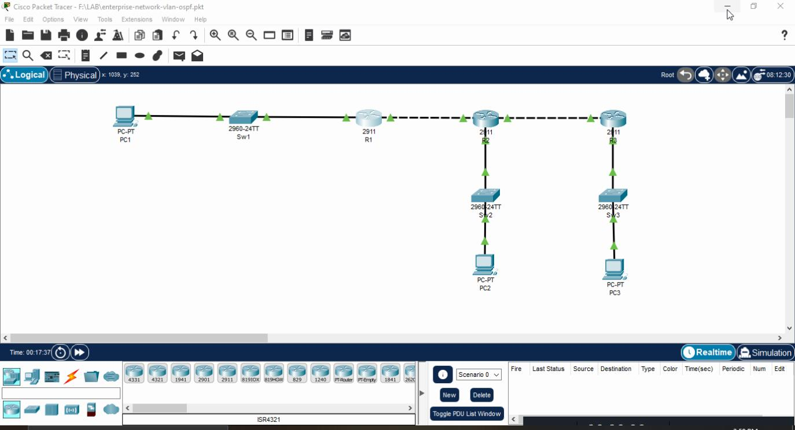
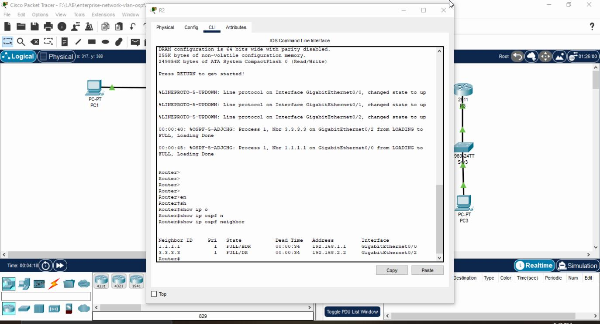
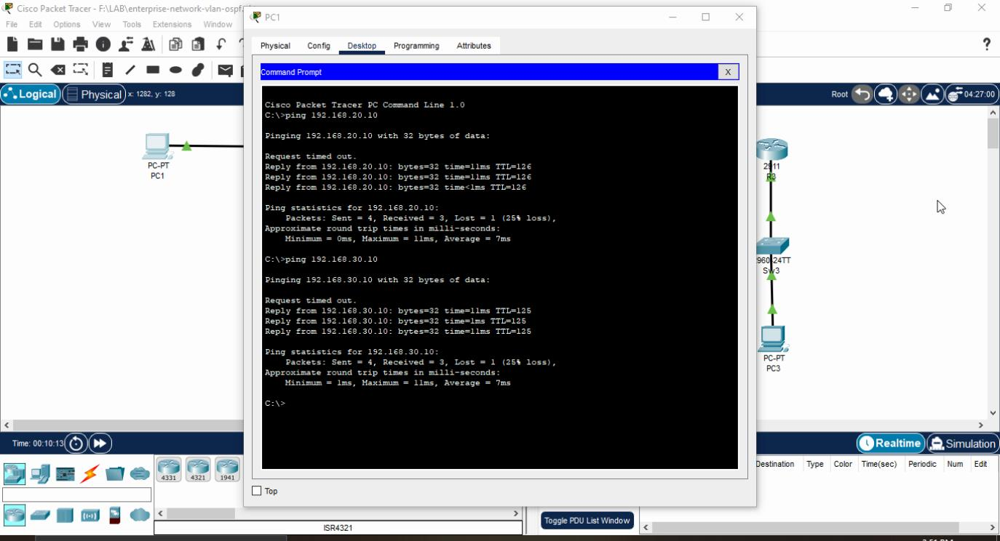

# Enterprise Network Routing with OSPF

## Overview

This lab is a small enterprise-style routed network built in Cisco Packet Tracer.

The network consists of three routers connecting three separate LANs. Static routing was initially configured to verify the IP addressing and Layer 3 connectivity. The network was then migrated to OSPF for dynamic route exchange.

The lab also covers OSPF Router ID configuration, passive interfaces, OSPF cost manipulation, and link-failure testing.

## Network Topology



## IP Addressing

| Device | Interface | IP Address      | Network         |
| ------ | --------- | --------------- | --------------- |
| R1     | G0/0      | 192.168.10.1/24 | 192.168.10.0/24 |
| R1     | G0/1      | 192.168.1.1/30  | 192.168.1.0/30  |
| R2     | G0/0      | 192.168.1.2/30  | 192.168.1.0/30  |
| R2     | G0/1      | 192.168.20.1/24 | 192.168.20.0/24 |
| R2     | G0/2      | 192.168.2.1/30  | 192.168.2.0/30  |
| R3     | G0/0      | 192.168.2.2/30  | 192.168.2.0/30  |
| R3     | G0/1      | 192.168.30.1/24 | 192.168.30.0/24 |

### End Devices

| Device | IP Address       | Default Gateway |
| ------ | ---------------- | --------------- |
| PC1    | 192.168.10.10/24 | 192.168.10.1    |
| PC2    | 192.168.20.10/24 | 192.168.20.1    |
| PC3    | 192.168.30.10/24 | 192.168.30.1    |

## Routing

### Initial Static Routing

Static routes were configured first to verify basic Layer 3 connectivity between the three LANs.

After end-to-end connectivity was confirmed, the static routes were removed.

### OSPF Configuration

OSPF was then deployed across the routed links using:

* OSPF Process ID: `1`
* Area: `0`
* R1 Router ID: `1.1.1.1`
* R2 Router ID: `2.2.2.2`
* R3 Router ID: `3.3.3.3`

The router-to-router interfaces participate in OSPF, while the LAN-facing interfaces are configured as passive interfaces.

## OSPF Verification

OSPF neighbor relationships were verified using:

```text
show ip ospf neighbor
```

The expected neighbor relationships were established in the `FULL` state.



Routing information was verified using:

```text
show ip route ospf
show ip route
```

OSPF-learned networks were present in the routing tables with the expected administrative distance and path cost.

The OSPF interface configuration and routing table were also reviewed during troubleshooting.


## OSPF Cost

OSPF path selection was tested by manually changing the interface cost on the R1-R2 link.

Example:

```text
interface g0/1
 ip ospf cost 50
```

Increasing the interface cost changed the calculated cost of routes using that path.

After testing, the interface was returned to its default OSPF cost.

This test verified how OSPF uses cumulative path cost when selecting routes.

## Link Failure Test

To verify OSPF convergence, the R1-R2 link was intentionally shut down:

```text
interface g0/1
 shutdown
```

The OSPF adjacency was removed and routes dependent on the failed path were withdrawn from the routing table.

After restoring the interface:

```text
no shutdown
```

the OSPF adjacency returned to `FULL` and the routes were learned again.

This test demonstrates OSPF failure detection and route reconvergence.

> Note: The current topology has no redundant path between R1 and R3. Therefore, this test demonstrates failure detection and reconvergence, not true redundant-path failover.

## Connectivity Verification

End-to-end connectivity was tested between all three LANs using ICMP.

The tests confirmed connectivity between:

* PC1 → PC2
* PC1 → PC3
* PC2 → PC1
* PC2 → PC3
* PC3 → PC1
* PC3 → PC2



## Troubleshooting

The following commands were used to verify and troubleshoot the routing environment:

```text
show ip interface brief
show ip ospf neighbor
show ip ospf interface
show ip route
show ip route ospf
ping
```

The troubleshooting process included checking interface status, OSPF adjacency state, routing-table entries, OSPF cost, and end-to-end connectivity.

## Technologies

* Cisco Packet Tracer
* Cisco IOS
* OSPF
* IPv4
* Static Routing
* Dynamic Routing
* ICMP

## Project Files

| File                          | Description                             |
| ----------------------------- | --------------------------------------- |
| `enterprise-network-ospf.pkt` | Cisco Packet Tracer project             |
| `topology.jpg`                | Network topology                        |
| `OSPF-nghb.jpg`               | OSPF neighbor verification              |
| `OSPF-routing.jpg`            | OSPF interface and routing verification |
| `end-to-end.jpg`              | End-to-end connectivity tests           |
